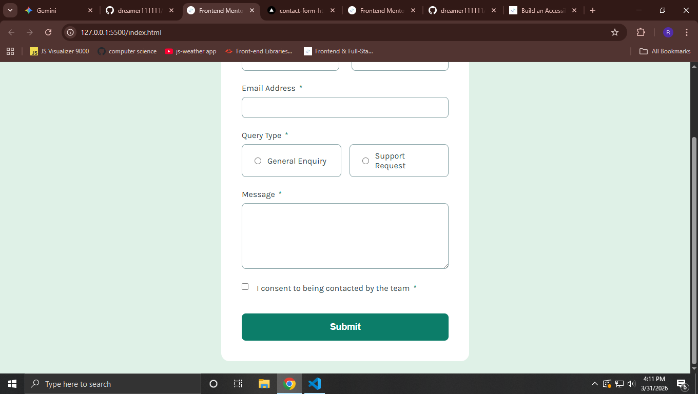

# Frontend Mentor - Contact Form Solution

This is a solution to the [Contact form challenge on Frontend Mentor](https://www.frontendmentor.io/challenges/contact-form-jy_96yWnuq). Frontend Mentor challenges help you improve your coding skills by building realistic projects.

## Table of contents

- [Overview](#overview)
  - [The challenge](#the-challenge)
  - [Screenshot](#screenshot)
  - [Links](#links)
- [My process](#my-process)
  - [Built with](#built-with)
  - [What I learned](#what-i-learned)
  - [Accessibility Features](#accessibility-features)
- [Author](#author)

## Overview

### The challenge

Users should be able to:

- Complete the form and see a success message upon triumphant submission.
- Receive validation errors if:
    - Any field is left empty.
    - The email address is not formatted correctly.
    - The consent checkbox is unchecked.
    - No query type is selected.
- See hover and focus states for all interactive elements on the page.
- View the optimal layout for the interface depending on their device's screen size.

### Screenshot



### Links

- Solution URL: [https://github.com/dreamer111111/contact-form-html-css-js]
- Live Site URL: [https://contact-form-html-css-js.vercel.app/]

## My process

### Built with

- Semantic HTML5 markup
- CSS custom properties (Variables)
- Flexbox
- Mobile-first workflow
- Vanilla JavaScript for validation

### What I learned

During this project, I focused on creating a robust validation system and ensuring high accessibility standards. I learned how to use the `:has()` selector in CSS to style parent containers based on the state of their children (the radio buttons).

```css
/* Styling the radio box based on whether the internal input is checked */
.radio-option:has(input:checked) {
  background-color: var(--green-200);
  border-color: var(--green-600);
}
```
### Accessibility Features
ARIA Attributes: Used aria-describedby to link inputs with their error messages and aria-invalid to notify screen readers of errors.

Reduced Motion: Implemented a prefers-reduced-motion media query to disable smooth scrolling for users who prefer less movement.

Keyboard Navigation: Ensured all interactive elements have visible focus states and logical tab order.

Author
Frontend Mentor - @dreamer111111  [https://www.frontendmentor.io/profile/dreamer111111]

Twitter - @royrudro032 [https://x.com/royrudro032]